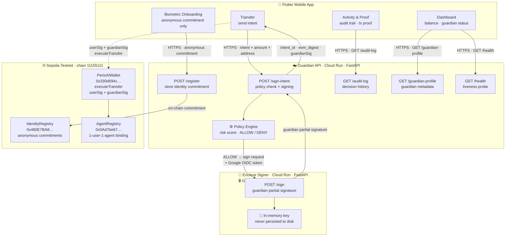

# PerisAI — AI Threshold Guardian Wallet

Privacy-first threshold wallet with a live FastAPI guardian service, a TEE-ready enclave signer, and Sepolia smart contracts.

## What Is Implemented

- Mobile app with biometric-style onboarding, dashboard, transfer, activity, and guardian detail screens
- FastAPI guardian API with policy checks, audit log, and live guardian profile endpoint
- Enclave signer service with service-to-service auth via Google OIDC ID token
- Sepolia deployment for `IdentityRegistry`, `PerisAIWallet`, and `AgentRegistry`
- Live Cloud Run deployment for backend and enclave signer

## Architecture



## Current Live Status

- Backend: https://perisai-guardian-api-305832734922.asia-southeast1.run.app
- Enclave: https://perisai-enclave-signer-305832734922.asia-southeast1.run.app
- Network: Sepolia, chain id `11155111`

## TEE Notes

The live Cloud Run enclave signer is TEE-ready and isolated, but the demo implementation still uses a simulated in-memory key flow.

- Key never leaves the signer process memory
- Gateway calls the signer through Google OIDC protected service-to-service auth
- Attestation endpoint is simulated in the demo build
- Production target: Cloud Run isolated service -> Confidential VM / Nitro-style enclave boundary

## Project Structure

```
backend/
  app/main.py                Guardian API — policy engine, audit log, enclave routing
  enclave/signer_service.py   Enclave signer — isolated key, attestation endpoint
  enclave_deploy/             Minimal deploy copy for the enclave Cloud Run image
  Dockerfile                  Cloud Run image for Guardian API
  Dockerfile.enclave          Cloud Run image for Enclave Signer
  README.md                   Backend quick start

contracts/
  PerisAIWallet.sol          2-signature threshold wallet
  IdentityRegistry.sol       Anonymous commitment registry
  AgentRegistry.sol          1-user-1-agent on-chain binding
  config/deployed.json       Live Sepolia addresses
  scripts/
    compile_contracts.sh     Compile ABI/BIN artifacts
    deploy_sepolia.py        Deploy contracts to Sepolia
    execute_transfer.py      Submit executeTransfer on-chain

frontend/lib/
  config/app_config.dart     Backend URL config (local or Cloud Run)
  controllers/               WalletController — all business logic
  pages/
    splash/                  Splash page
    biometric/               Biometric simulation + register
    dashboard/               Balance, guardian status, recent activity
    transfer/                Send intent, ALLOW/DENY demo scenarios
    activity/                Decision timeline
  theme/app_theme.dart       Design tokens — colors, icons, status
  README.md                  Flutter app quick start
```

## Run Locally

**Backend:**
```bash
cd backend
pip install -r requirements.txt
uvicorn app.main:app --reload --port 8000
```

**Enclave Signer (optional, separate terminal):**
```bash
uvicorn backend.enclave.signer_service:app --port 8001 --host 127.0.0.1
```

**Flutter:**
```bash
cd frontend
flutter pub get
flutter run
```

For Android emulator, set in `frontend/lib/config/app_config.dart`:
```dart
defaultValue: 'http://10.0.2.2:8000'
```

## Environment Variables

| Variable | Used By | Purpose |
|---|---|---|
| `BACKEND_URL` | Flutter app | Points the mobile app to local backend or Cloud Run |
| `ENCLAVE_URL` | Backend | Routes signing calls to the enclave signer service |
| `CHAIN_ID` | Backend / contracts | Sepolia chain id is `11155111` |

For the mobile app, `BACKEND_URL` can be passed at runtime with `--dart-define`.

## Tests

```bash
cd backend
python -m pytest tests/ -v
# smoke + integration, includes digest Python=Solidity verification
```

## Troubleshooting

- If the app shows `Guardian: ERROR`, check the backend `/health` endpoint first.
- If `enclave_status` is not `ok`, confirm `ENCLAVE_URL` is set on the backend service.
- If Flutter still points to the wrong backend, run with `--dart-define=BACKEND_URL=...`.
- If generated Flutter files appear changed after `flutter pub get` or `flutter build`, restore them before committing.
- If `flutter analyze` reports the Flutter lints include warning, run `flutter pub get` in `frontend/`.

## Deploy to Cloud Run (Project: perisai-490814)

```bash
# First time only
gcloud auth login
gcloud config set project perisai-490814
chmod +x deploy.sh && ./deploy.sh
```

The Flutter app already defaults to the live backend URL. To override it locally, run:
```bash
flutter run --dart-define=BACKEND_URL=https://perisai-guardian-api-305832734922.asia-southeast1.run.app
```

## Deploy Contracts to Sepolia

```bash
cd contracts/scripts
pip install -r requirements.txt

# Step 1: Compile contracts
chmod +x compile_contracts.sh && ./compile_contracts.sh

# Step 2: Fill in contracts/.env (copy from contracts/.env.example)

# Step 3: Deploy
python deploy_sepolia.py
```

## 60-Second Demo Flow

1. Open the app and show the splash/biometric onboarding.
2. Register the identity and show the Dashboard becoming `READY`.
3. Open Transfer and send to the trusted address for `ALLOW`.
4. Send a suspicious transfer to show `DENY`.
5. Open Activity or Guardian Detail to show the audit trail, risk score, and live enclave status.

## Demo Scenarios

| Scenario | Action | Guardian Decision |
|---|---|---|
| Safe transfer | Send to Trusted Address, amount below policy limit | ALLOW — guardian signature issued |
| Suspicious transfer | Simulate Suspicious Transfer, amount above limit or unknown address | DENY — no guardian signature |
| Audit trail | Open Activity or Guardian Detail | Decision and risk score recorded |

## Key Talking Points

| Question | Answer |
|---|---|
| Who guards the guardian? | The enclave signer process. The key stays in memory and never leaves the signer boundary. |
| Is this real on-chain? | Yes. `PerisAIWallet`, `IdentityRegistry`, and `AgentRegistry` are deployed on Sepolia. |
| What is private? | Raw biometric data never leaves the device. The app sends an anonymous commitment and intent data only. |
| What is live today? | Cloud Run backend, Cloud Run enclave signer, live audit log, live policy checks, live Sepolia contracts. |
| What is still simulated? | The demo attestation document and the biometric capture flow. |
| Why two signatures? | Neither the user nor the guardian should move funds alone; both signatures are required. |
| Why AgentRegistry? | It gives a clean 1-user-1-agent binding for future guardian/account isolation. |

## Good To Know

- The main mobile flow is Splash -> Biometric -> Dashboard -> Transfer -> Activity -> Guardian Detail
- `frontend/lib/config/app_config.dart` is the single place for backend URL defaults
- `backend/README.md` and `frontend/README.md` contain short, app-specific run guides
- `wallet_home_page.dart` is a legacy/demo page and not part of the primary production flow
